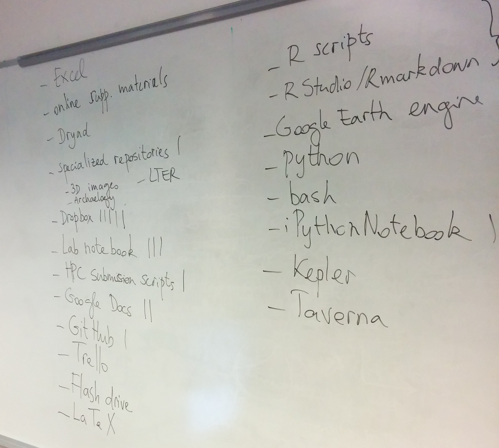
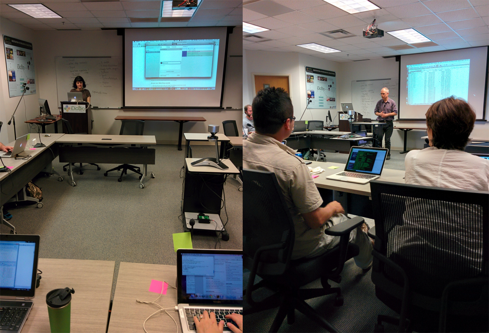

```{r setup, message=FALSE, echo=FALSE}
library(cowplot)
library(ggplot2)
library(wesanderson)
library(dplyr)

knitr::opts_chunk$set(fig.width = 9, echo = FALSE, message = FALSE, warning = FALSE,
                      fig.align = "center")
theme_set(theme_cowplot(font_size = 12))

pre_srv <- read.csv(file="preworkshop_survey.csv", stringsAsFactors = FALSE)

names(pre_srv) <- c(
"Timestamp",
"current_position",
"discipline",
"OS",
"record_method",
"programming_frequency",
"programming_language",
"sharing_frequency",
"sharing_confidence",
"sharing_reason",
"why_signup"
)

pre_srv[["current_position"]][match("USGS Core Science Analytics and Synthesis", pre_srv[["current_position"]])] <- "staff"

pre_srv[["record_method"]] <- gsub("my brain|Trello", "Other", pre_srv$record_method)

pre_srv$current_position <- reorder(pre_srv$current_position, pre_srv$current_position, table)

pre_srv$sharing_confidence <- factor(pre_srv$sharing_confidence,
                                     levels = c("Not confident",
                                                "Not very confident", "Somewhat confident",
                                                "Confident", "Very confident"))

prg_freq_data <- pre_srv$programming_frequency %>%
  strsplit(split = ", ") %>% unlist %>%
  reorder(., ., table) %>% data.frame("prg_freq" = .)

rcd_mtd_data <- pre_srv$record_method %>%
  gsub("\\([^)]*\\)", "", .) %>%
  strsplit(split = ",") %>%
  unlist %>%
  gsub("^\\s+", "", .) %>%
  gsub("\\s+$", "", .) %>%
  reorder(., ., table) %>% data.frame("rcd_mtd" = .)

sharing_reas_data <- pre_srv$sharing_reason %>%
  strsplit(split = ", ") %>% unlist %>%
  data.frame("sharing_reas" = ., stringsAsFactors = FALSE)

freq_sharing_reas <- table(sharing_reas_data$sharing_reas)
sharing_others <- names(freq_sharing_reas[freq_sharing_reas == 1])
sharing_reas_data$"sharing_reas" <- as.character(sharing_reas_data$"sharing_reas")
sharing_reas_data$"sharing_reas"[sharing_reas_data$sharing_reas %in% sharing_others] <- "Other"

sharing_reas_data$sharing_reas <- reorder(sharing_reas_data$sharing_reas,
                                          sharing_reas_data$sharing_reas, table)

cur_pos <- ggplot(pre_srv) + geom_bar(aes(x = current_position), fill = wes_palette("Zissou")[1]) +
  coord_flip() + xlab("Current position")

prg_freq <- ggplot(prg_freq_data) + geom_bar(aes(x = prg_freq), fill =  wes_palette("Zissou")[3]) +
  coord_flip() + xlab("How often do you program?")


rcd_mtd <-  ggplot(rcd_mtd_data) + geom_bar(aes(x = rcd_mtd), fill = wes_palette("Zissou")[1]) +
  coord_flip() + xlab("How do you document your methods?")

rcd_conf <- ggplot(pre_srv) + geom_bar(aes(x = sharing_confidence), fill = wes_palette("Zissou")[3]) +
  coord_flip() + xlab("How confident are you about your documentation?")


shr_freq <- ggplot(pre_srv) + geom_bar(aes(x = sharing_frequency), fill = wes_palette("Zissou")[1]) +
  coord_flip() + xlab("How frequently do you make your code/data available?")

shr_reas <-  ggplot(sharing_reas_data) + geom_bar(aes(x = sharing_reas), fill = wes_palette("Zissou")[3]) +
  coord_flip() + xlab("Why do you make your code/data available?")

```

By François Michonneau, @fmic_

Reproducibility is one the corner stones of the scientific process. How the
numbers (e.g., statistics and p-values) found in your manuscript and where the
data points that are making up your plots are coming from, should be made clear
to your readers. As analytical methods are growing more sophisticated and data
sets are becoming larger, it is both getting more important and easier to do.

It is getting more important as basic data manipulations that could be explained
in words until recently, are becoming too intricate to explain in details when
the analyses are conducted on large datasets that require programmatic
modification of their content. The modifications brought to the data are often
easier to share by providing readers the scripts that have been used to generate
the datasets, statistics or figures included in the manuscript.

It is also getting easier to do as the programming languages commonly used in
science provide effective ways to integrate the text for the manuscript and the
code used to generate the results. This approach coined **literate programming**
is exemplified in Python with the iPython notebooks, and in R with Rmarkdown and
knitr. If these technologies facilitate literate programing, they are typically
not taught as part of the traditional university curriculum, and yet these
technologies have the potential to accelerate science while making results more
robust and more transparent.

To me, the largest advantage of making my science reproducible and using
literate programing is that it saves me a lot of time by automating my
workflow. I do not have to worry about remaking figures manually or re-creating
intermediate data sets when new data comes in or if errors are detected in the
raw data. All of these outputs can easily be regenerated by running scripts.

On June 1st and 2nd, 21 people (including 5 remote participants) participated in
the second Reproducible Science Workshop organized at iDigBio. The instructors
were [Hilmar Lapp](https://twitter.com/hlapp) (Duke Genome Center),
[Ciera Martinez](https://twitter.com/CieraReports) (UC Davis), and myself
(iDigBio). The helpers ([Judit Ungvari-Martin](https://twitter.com/jungvari),
[Deb Paul](https://twitter.com/idbdeb),
[Kevin Love](https://twitter.com/KevinJLove)) ensured that the workshop was
running smoothly and assisted participants as needed.

## Who were the participants?

Before the workshop, we asked participants to fill out a survey to get a sense
of our audience and to assess what they were expecting from the workshop.

Most of the participants were graduate students from the Life Sciences who
program everyday (but some programmed rarely), and almost all of them use R
regurlarly (17 out of the 22 respondants[^1]).

```{r plot-who}
plot_grid(cur_pos, prg_freq)
```

[^1]: Some participants cancelled at the last minute and others who participated
    in the workshop didn't fill ou the survey. Therefore, we don't have an exact
    correspondance between the number of respondants and the participants.

We also asked partcipants how they currently record their data and whether they
feel confident that one of their colleagues could reproduce results and figures
given the data and their notes. Most people reported using a lab notebook or
online documents. The majority reported being "confident" or "somewhat
confident" that their documentation was sufficient for their colleagues to
reproduce their results, but nearly half the participants reported being "not
very confident" while nobody chose the "Very confident" option.

```{r plot-records}
plot_grid(rcd_mtd, rcd_conf)
```

Finally, we asked participants how often they share their code/data/analysis and
why they are doing it. Interestingly, "opinion of colleagues" seems to be one of
the main drivers of sharing code/data/analysis. Indicating that "peer-pressure"
is perceived as being more important than requirements by journals and funding
agencies among the early adopters.

```{r plot-sharing}
plot_grid(shr_freq, shr_reas)
```


## Organization of the workshop

We kicked off the workshop by asking participants the tools and methods they
currently use to document their analyses. Even though we ask a similar question,
we have found that this exercise is a great way to break the ice, and get the
conversation started.



Ciera taught a module that highlights the common challenges associated with
working in a non-reproducible context. We asked partcipants to generate simple
plots from the Gapminder dataset and to write the documentation on how to
reproduce it. They then gave the instructions to their neighbors that tried to
make the plots. For this exercise, most participants resorted to Excel and they
realized how challenging it can be to write detailed enough instructions to have
someone repeat a plot. After this exercise, they get introduced to literate
programing in R with knitr and Rmarkdown. Participants who discovered this for
the first time let escape some "WOW".

In the afternoon of the second day, Hilmar introduced participants best
practices on how to name and organize files to facilitate reproducibility, while
working with a slightly more realisitic knitr document. Participants got
introduced to the benefit of programmatic modifications of the data. Overall,
this module is really well received because it provides participants with many
tips and best practices to organize files in research projects.



During the first workshop at Duke, participants repeatedly requested to learn
more about version control, especially Git and GitHub. Karen Cranston improvised
a quick demonstration, but for the second workshop Ciera put together a module
(adapted from the lesson from Software Carpentry) using the GitHub GUI
tool. Participants clearly understood the benefit of version control, and
starting with the GUI was great to make it accessible to most
participants. However, because of the variety of operating systems (and
versions), it was difficult to provide instructions that worked for everyone,
especially given that some participants had operating systems that did not
support the GUI.

For the rest of the second day, François covered how to organize your code into
function within your knitr document to automate the generation of the
intermediate datasets, figures and manuscript. While most participants had had
previous experience with R, few knew how to write functions. This was a good
time to introduce them to this (sometimes) underrated approach at organizing
code.

To finish these 2 days, Hilmar covered the different licenses and publishing
platforms that allow researchers to make publicly available their manuscripts,
code and data. Most participants had heard of Creative Commons licenses or Dryad
but few knew enough to navigate this growing ecosystem.

Overall, the workshop was well received by participants. 87% indicated in the
post-workshop survey that their ability to conduct reproducible was higher or
much higher than prior to the workshop.

## Resources

* [wiki](https://www.idigbio.org/wiki/index.php/Reproducible_Science_Workshop)
* [Workshop website](http://reproducible-science-curriculum.github.io/2015-06-01-reproducible-science-idigbio/)
* [GitHub Repository](https://github.com/Reproducible-Science-Curriculum/) for
  all the lessons
